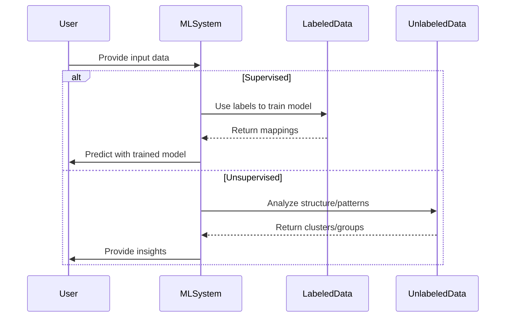

# Supervised vs Unsupervised Learning: A Friendly Guide for Everyone

## A Real-World Conversation

**Anya and Raj** are having coffee.

> **Anya:** I have a dataset of emails marked as spam or not. I want to build a model to filter future spam.

> **Raj:** That sounds like a supervised learning problem.

> **Anya:** Interesting! What if I had a bunch of emails with no labels, and I just wanted to group them?

> **Raj:** Then you’re in unsupervised learning territory.

This simple conversation captures the **essence of machine learning's two foundational approaches**: **Supervised Learning** and **Unsupervised Learning**.

---

## What is Supervised Learning?

Supervised learning is like teaching a child using flashcards. You show the model labeled data (input and correct output), and it learns to map the input to the output.

### Why is it needed?

- You already know the desired output.
- You want to make predictions on new, unseen data.
- You want high accuracy and have labeled data available.

### Examples

- Email spam detection (emails labeled as spam or not) — *Tool: Gmail spam filter*
- Predicting house prices (based on past data with known prices) — *Tool: Zillow Zestimate*
- Medical diagnosis (symptoms as input, diagnosis as output) — *Tool: IBM Watson Health*

---

## What is Unsupervised Learning?

Unsupervised learning is like giving a pile of LEGO pieces to someone and watching how they sort them without instructions. The model finds hidden patterns or groupings in the data.

### Why is it needed?

- You don't have labels or predefined categories.
- You want to explore or understand your data structure.
- You’re doing data compression, noise removal, or customer segmentation.

### Examples

- Customer segmentation in marketing — *Tool: Salesforce Einstein Segmentation*
- Grouping news articles by topics — *Tool: Google News Clustering*
- Anomaly detection in network traffic — *Tool: Splunk Anomaly Detection*

---

## Key Differences

| Feature | Supervised Learning               | Unsupervised Learning            |
| ------- | --------------------------------- | -------------------------------- |
| Data    | Labeled                           | Unlabeled                        |
| Goal    | Predict outcomes                  | Discover hidden patterns         |
| Output  | Known (classification/regression) | Unknown (clusters, structures)   |
| Example | Spam detection, price prediction  | Clustering users, topic modeling |

---

## Sample Sequence Diagram

## Types of Supervised Learning

1. **Classification** – Predict categories (e.g., dog vs. cat)
2. **Regression** – Predict continuous values (e.g., house price)

## Types of Unsupervised Learning

1. **Clustering** – Group similar items (e.g., K-Means)
2. **Dimensionality Reduction** – Reduce data size while preserving structure (e.g., PCA)
3. **Association Rule Learning** – Discover rules that capture relationships (e.g., Market Basket Analysis)

---

## Remember

Machine Learning isn't magic—it's patterns, logic, and the right tool for the right job. 

---

